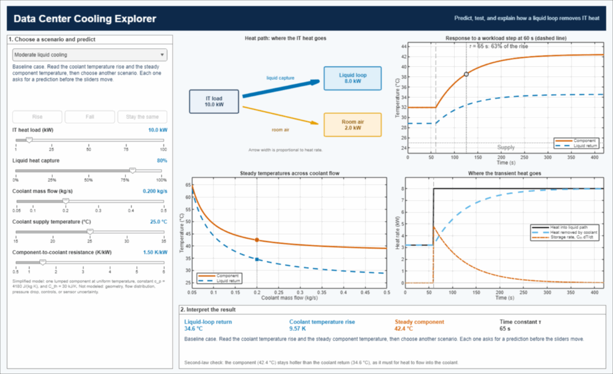

# Data Center Cooling Explorer

[](https://matlab.mathworks.com/open/github/v1?repo=UARK-NED3/Data-Center-Cooling-Explorer&file=ExploreDataCenterCooling.m)

Every watt of IT power becomes heat. In a liquid-cooled rack, that heat must cross from a component into a coolant stream and leave the rack with it. This MATLAB live script and app teach what sets the coolant and component temperatures: the steady energy balance, the second law, the thermal resistance between the component and the coolant, and the component's thermal storage. Learners predict how an output will change before each scenario loads, then compare the prediction with the model. The central example is a model that accounts for every watt yet predicts coolant leaving hotter than the component that heats it.



> **Scope.** All inputs are synthetic, declared assumptions chosen for teaching. The model is a one-node lesson, not a calibrated rack, cold-plate, CDU, pump, or facility model, and the repository contains no licensed inventory records, operational telemetry, or vendor data.

## Quick start

Click **Open in MATLAB Online** above, or clone the repository and run:

```matlab
cd('Data-Center-Cooling-Explorer')
open ExploreDataCenterCooling   % guided lesson (live script)
DataCenterCoolingExplorer       % or launch the interactive app directly
```

Only base MATLAB is required; Simscape and other toolboxes are not used. The automated tests pass in MATLAB R2025b and R2023a. The guided lesson is saved in the plain-text live-script format introduced in R2025a, so it opens with formatted text, equations, and an embedded slider in R2025a or later, including MATLAB Online. Earlier releases read the same file as an ordinary script whose narrative markup is comments; the R2023a test run executes it end to end.

## What learners do

### Guided live script: `ExploreDataCenterCooling.m`

1. **Why carry the heat in a liquid?** Compare the volume flows of water and air that carry 10 kW with a 10 K temperature rise.
2. **The energy balance sets the coolant temperature rise.** An embedded slider moves the operating point along $\Delta T = Q_{\mathrm{liquid}}/(\dot{m}c_p)$. The section ends with a prediction: does lower flow make the component hotter?
3. **A model that balances energy and still fails.** A shortcut that references the component's thermal resistance to the supply temperature closes the energy balance exactly, yet at low flow it predicts coolant leaving hotter than the component that heats it.
4. **Let the coolant warm along the wall.** A wall-coupled (effectiveness–NTU) model restores the second law and answers the prediction.
5. **Thermal storage sets the response time.** A workload step reveals the time constant $\tau = R_{\mathrm{eff}}C_{\mathrm{th}}$.
6. **Predict, test, and explain** in the interactive Explorer.
7. **Transfer question:** which measurements would be needed before comparing the model with a physical rack, and what a matching return temperature would and would not confirm.

### Interactive Explorer: `DataCenterCoolingExplorer.m`

Choose a scenario from the menu. The Explorer asks for a prediction (**Rise**, **Fall**, or **Stay the same**), loads the scenario only after the learner commits, and then explains the change it computes relative to the baseline.

| Scenario | Change from the baseline | Quantity to predict |
|---|---|---|
| Moderate liquid cooling | Baseline: 10 kW, 80% liquid capture, 0.20 kg/s, 25 °C supply, 1.5 K/kW | — |
| Flow-limited loop | Coolant flow 0.20 → 0.08 kg/s only | Steady component temperature |
| Lower thermal resistance | Component-to-coolant resistance 1.5 → 0.75 K/kW only | Liquid-loop return temperature |
| High-density stress test | 40 kW, 90% liquid capture, 0.25 kg/s, 2.0 K/kW | Heat left for the room-air path |

Every view updates while a slider is dragged:

1. **Heat path** splits IT heat between the liquid loop and room air, with arrow width proportional to heat rate.
2. **Transient response** to a workload step at 60 s, with the time constant marked on the component curve.
3. **Steady temperatures across coolant flow** show the component and return temperatures for the full flow range, with the current operating point marked and a 1-atm boiling reference when it is in range.
4. **Where the transient heat goes** separates heat entering the liquid path, heat removed by the coolant, and the component's storage rate.

A cue line beneath the readouts reports a second-law check, a caution when the one-node component estimate reaches 85 °C, or a warning when the coolant return reaches 100 °C, where water at atmospheric pressure would boil and the single-phase model no longer applies.

## Model

All calculations use SI units; displayed temperatures are in degrees Celsius. The synthetic coolant has a constant specific heat capacity of $4180\ \mathrm{J\,kg^{-1}\,K^{-1}}$, representative of liquid water over a limited temperature range, and the component has an effective thermal capacitance of $30\ \mathrm{kJ\,K^{-1}}$. Both are illustrative choices, not property or hardware models.

### Steady liquid-loop accounting

For IT heat load $Q_{\mathrm{IT}}$ and declared liquid heat-capture fraction $f_{\mathrm{liquid}}$,

$$
Q_{\mathrm{liquid}}=f_{\mathrm{liquid}}Q_{\mathrm{IT}}, \qquad
Q_{\mathrm{air}}=(1-f_{\mathrm{liquid}})Q_{\mathrm{IT}}, \qquad
T_{\mathrm{return}}-T_{\mathrm{supply}} = \frac{Q_{\mathrm{liquid}}}{\dot{m}c_p}.
$$

### Component-to-coolant coupling

The component is a uniform-temperature wall that heats the coolant as it flows past. With wall conductance $UA = 1/R_{\mathrm{th}}$,

$$
\mathrm{NTU}=\frac{UA}{\dot{m}c_p}, \qquad
\varepsilon = 1-e^{-\mathrm{NTU}}, \qquad
R_{\mathrm{eff}}=\frac{1}{\varepsilon\,\dot{m}c_p}, \qquad
T_{\mathrm{component}} = T_{\mathrm{supply}} + Q_{\mathrm{liquid}}R_{\mathrm{eff}}.
$$

This is the standard heat-exchanger result for one stream heated by a wall at uniform temperature. Because $\varepsilon \le 1$, the return temperature cannot exceed the component temperature. At high flow, $R_{\mathrm{eff}} \to R_{\mathrm{th}}$; as $R_{\mathrm{th}} \to 0$, $R_{\mathrm{eff}} \to 1/(\dot{m}c_p)$ and the coolant leaves at the component temperature.

### Transient component model

$$
C_{\mathrm{th}}\frac{dT_{\mathrm{component}}}{dt} = Q_{\mathrm{liquid}}(t) - \frac{T_{\mathrm{component}}-T_{\mathrm{supply}}}{R_{\mathrm{eff}}}, \qquad
\tau = R_{\mathrm{eff}}C_{\mathrm{th}}.
$$

The IT load is held constant between time samples, so the code evaluates the exact exponential solution on each interval rather than integrating numerically. The coolant is treated as quasi-steady (its own heat capacity is neglected), and the return temperature follows from the instantaneous heat transferred to it.

### Correction in version 0.3.0

Versions 0.1.0 through 0.2.0 computed $T_{\mathrm{component}} = T_{\mathrm{supply}} + Q_{\mathrm{liquid}}R_{\mathrm{th}}$, referencing the resistance to the supply temperature. That shortcut closes the energy balance, but it makes the component temperature independent of coolant flow, and for flows below $1/(R_{\mathrm{th}}c_p)$ (about 0.16 kg/s at 1.5 K/kW) it predicts coolant leaving hotter than the component. The v0.2.0 flow-limited scenario showed a 72.8 °C return from a 49.0 °C component. The live script now uses this shortcut as the counterexample in Section 3.

### Explicit exclusions

The model does **not** resolve rack geometry, multiple servers, spatial hotspots, manifold flow distribution, cold-plate performance, pressure drop, pump power, facility controls, water use, reliability, or measurement uncertainty. The 85 °C cue is a teaching prompt, not an equipment limit, and the 100 °C boiling reference applies to water at atmospheric pressure; pressurized loops boil at higher temperatures. Do not use the model for equipment selection, operational decisions, or a claim of empirical validation.

## Verification

Run the automated tests from the MATLAB command window:

```matlab
cd('Data-Center-Cooling-Explorer')
addpath('tests')
runTests
```

The 26 tests check:

- the steady heat partition, coolant temperature rise, inverse flow relation, zero-capture limit, and invalid-input rejection;
- that the return temperature stays below the component temperature across a grid of loads, flows, and resistances, including the former v0.2.0 flow-limited case;
- the effectiveness–NTU relation, its high-flow and negligible-resistance limits, the monotonic fall of component temperature with flow, and the unchanged return temperature when only the resistance changes;
- the exact transient solution against an independent `ode45` integration, the integrated energy balance, and the 63% rise after one time constant;
- that the controlled scenarios change exactly one input and that every prediction answer agrees with the model;
- the app (launch, live slider updates, the prediction gate, feedback on an incorrect prediction, the caution and boiling cues, and legend contents) and an end-to-end run of the live script; and
- that the default Explorer window stays within a small reported display and keeps its preferred size when the reported display is degenerate.

These tests verify the code against its own governing equations. They do not validate the model against measured rack data.

## Reproducible previews

To regenerate the four still images and the animated demo in `docs/` from the current code:

```matlab
run('scripts/renderPreview.m')
```

## License and attribution

Code is released under the Apache License 2.0. See [LICENSE](LICENSE). The Explorer is an educational companion to the [Data Center Cooling Research Tools](https://github.com/UARK-NED3/Data-Center-Cooling-Research-Tools) hub; cite the hub for the research context. This repository does not reproduce the hub's third-party datasets.

## Project status

Version `0.3.0` is the current development version. Its calculations, app, and live script pass the automated tests listed above. The project has not been validated against measured rack data.
