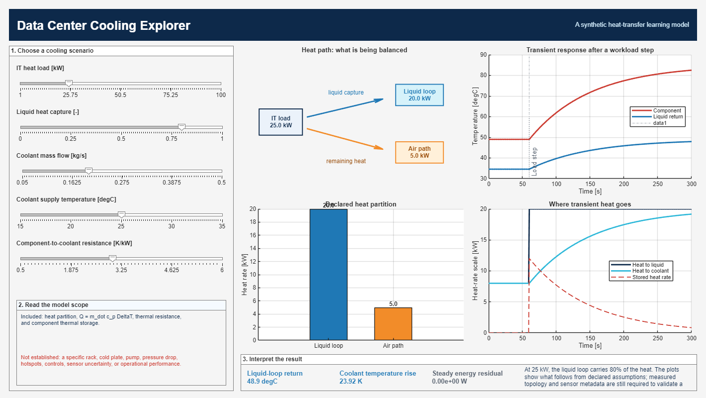

# Data Center Cooling Explorer

An interactive MATLAB learning experience that connects IT heat load to liquid-loop heat capture, coolant temperature rise, component thermal storage, and model evidence needs.



> **Scope and evidence.** This repository contains a synthetic, assumption-driven lesson. It is not a calibrated data-center rack, cold-plate, CDU, pump, or facility model. It contains no licensed inventory records, operational telemetry, or vendor data.

## Why this exists

A liquid-cooling calculation can satisfy the familiar heat balance

$$
Q_{\mathrm{liquid}}=\dot{m}c_p\left(T_{\mathrm{return}}-T_{\mathrm{supply}}\right)
$$

without establishing that it predicts a real rack. The Explorer lets users vary declared inputs and see what follows from the governing energy balance. It also makes the missing evidence visible: rack topology, component/cold-plate configuration, flow distribution, pressure drop, sensor definitions, uncertainty, and operating conditions are necessary before a model can be validated against a physical system.

The project is an educational companion to the [Data Center Cooling Research Tools](https://github.com/UARK-NED3/Data-Center-Cooling-Research-Tools) hub and its synthetic benchmark cases. It is intentionally narrower than that hub: this repository teaches a physical idea through an interactive MATLAB experience.

## Quick start

Tested with MATLAB R2025b. Only base MATLAB is required; Simscape and Simscape Fluids are not required.

```matlab
cd('Data-Center-Cooling-Explorer')
DataCenterCoolingExplorer
```

Move the sliders, then interpret the four panels:

1. **Heat path** partitions IT heat between a declared liquid-capture fraction and a residual air path.
2. **Transient response** applies a workload step at 60 s to a component with a lumped thermal capacitance.
3. **Declared heat partition** reports the steady heat-rate split.
4. **Where transient heat goes** distinguishes instantaneous heat routed to the loop, heat transferred to coolant, and temporary component energy storage.

## Model

All calculations use SI units, except displayed temperatures in degrees Celsius. The synthetic coolant is assigned a constant specific heat capacity of $4180\ \mathrm{J\,kg^{-1}\,K^{-1}}$, representative of liquid water over a limited temperature range. This is an illustrative property choice, not a fluid-property model.

### Steady liquid-loop accounting

For IT heat load $Q_{\mathrm{IT}}$ and user-selected liquid heat-capture fraction $f_{\mathrm{liquid}}$,

$$
Q_{\mathrm{liquid}}=f_{\mathrm{liquid}}Q_{\mathrm{IT}}, \qquad
Q_{\mathrm{air}}=(1-f_{\mathrm{liquid}})Q_{\mathrm{IT}}.
$$

The liquid-loop temperature rise is

$$
\Delta T_{\mathrm{coolant}} = \frac{Q_{\mathrm{liquid}}}{\dot{m}c_p}.
$$

### Transient component model

The lesson uses one component temperature state coupled to a fixed-temperature coolant supply:

$$
C_{\mathrm{th}}\frac{dT_{\mathrm{component}}}{dt} = Q_{\mathrm{liquid}} - Q_{\mathrm{to\ coolant}},
\qquad
Q_{\mathrm{to\ coolant}} = \frac{T_{\mathrm{component}}-T_{\mathrm{supply}}}{R_{\mathrm{th}}}.
$$

The return temperature follows from $Q_{\mathrm{to\ coolant}}=\dot{m}c_p(T_{\mathrm{return}}-T_{\mathrm{supply}})$. The code solves this ordinary differential equation with `ode45` and computes the energy residual directly from the governing equation.

### Explicit exclusions

The model does **not** resolve rack geometry, multiple servers, spatial hotspots, manifold flow distribution, cold-plate performance, pressure drop, pump power, heat-exchanger effectiveness, facility controls, water use, reliability, or measurement uncertainty. Do not use it for equipment selection, operational decisions, or a claim of empirical validation.

## Verification

Run the tested baseline from the MATLAB command window:

```matlab
cd('Data-Center-Cooling-Explorer')
addpath('tests')
runTests
```

The test suite checks:

- steady heat partition and $\dot{m}c_p\Delta T$ reconstruction;
- the inverse relation between coolant flow and temperature rise;
- the zero-liquid-capture limiting case;
- invalid-input rejection;
- transient energy conservation; and
- the one-node model’s analytical steady-temperature limit.

## Reproducible preview

To regenerate the README image from the current code:

```matlab
run('scripts/renderPreview.m')
```

## Contest release plan

The MATLAB Central File Exchange package will contain the tested source, this README, a release note, and synthetic inputs only. The File Exchange entry will use the contest tag `25yrcontest` and link back to this repository.

## License and attribution

Code is released under the Apache License 2.0. See [LICENSE](LICENSE). Cite the [Data Center Cooling Research Tools](https://github.com/UARK-NED3/Data-Center-Cooling-Research-Tools) hub for the research context; this Explorer does not reproduce its third-party datasets.

## Project status

Version `0.1.0` is the initial public development release. Its heat-balance calculations and MATLAB interface have been tested on MATLAB R2025b. The project has not been independently validated against measured rack data.
